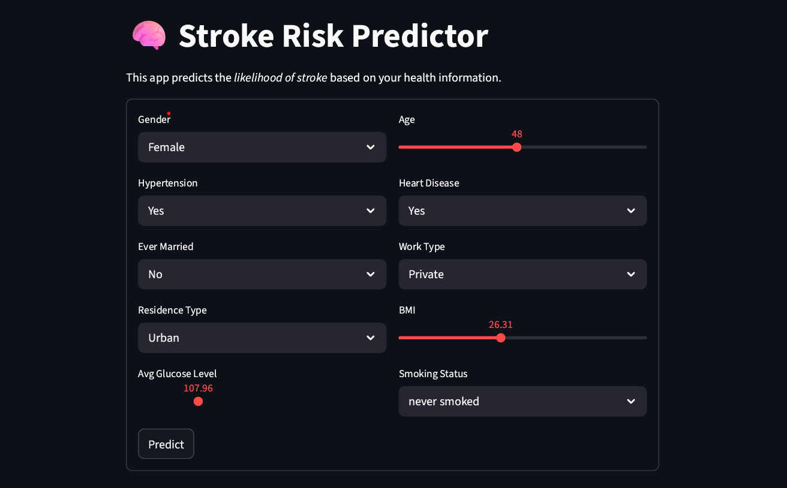
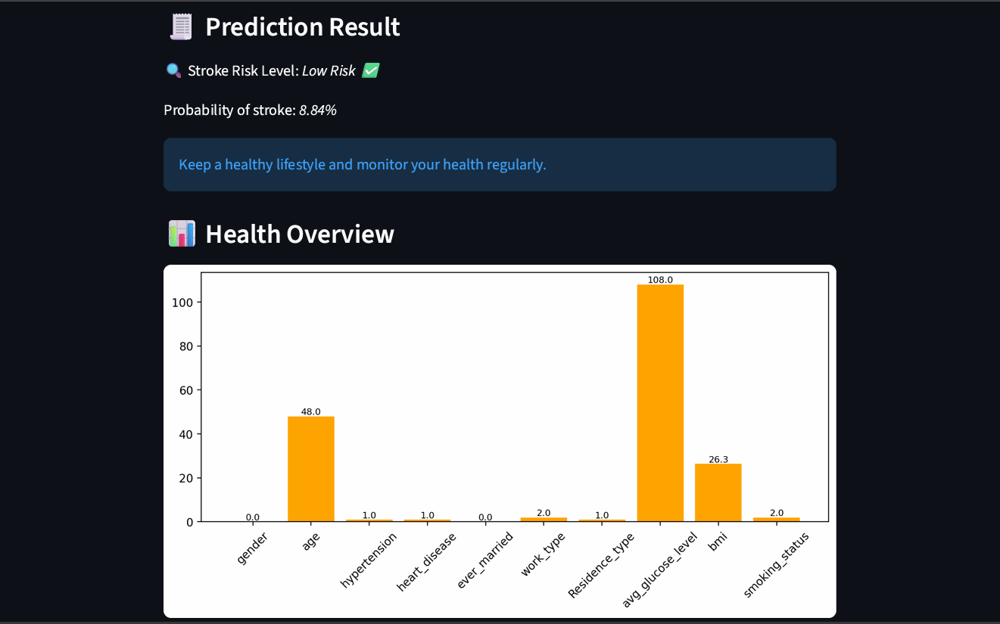

# Stroke Prediction ML Web App

An AI-powered web application that predicts the likelihood of stroke using machine learning and real-time user inputs.

This project demonstrates end-to-end ML workflow — from data preprocessing and model training to deployment using Streamlit.

## Project Overview

Stroke is one of the leading causes of death and long-term disability worldwide. Early detection of risk factors can significantly improve prevention and treatment outcomes.

This project builds a supervised machine learning model trained on healthcare data to predict stroke probability based on patient health indicators such as:

- Age
- Hypertension
- Heart disease
- Average glucose level
- BMI
- Smoking status
- Work type
- Marital status

The trained model is deployed as an interactive Streamlit web application for real-time predictions.

## Key Features

- Interactive and user-friendly web interface
- Real-time stroke risk prediction
- Clean data preprocessing pipeline
- Label encoding & feature transformation
- Trained and serialized ML model
- Visualization support using Matplotlib
- Production-ready project structure

## Machine Learning Model

- **Algorithm Used:** Random Forest Classifier *(update if different)*
- **Framework:** Scikit-learn
- **Preprocessing Steps:**
  - Handling missing values
  - Label Encoding categorical features
  - Feature scaling (if applied)
  - Train-test split validation
- **Evaluation Metrics:**
  - Accuracy Score
  - Confusion Matrix

The model was trained and saved using `joblib` for deployment efficiency.

## Application Preview

### 🔹 Input Interface


### 🔹 Prediction Result



## How to Run Locally

### 1️⃣ Clone the Repository

```bash
git clone https://github.com/your-username/stroke-prediction-ml.git
cd stroke-prediction-ml

2️⃣ Create Virtual Environment
py -m venv venv

3️⃣ Activate Environment
venv\Scripts\Activate

4️⃣ Install Dependencies
pip install -r requirements.txt

5️⃣ Run the Application
streamlit run app.py
